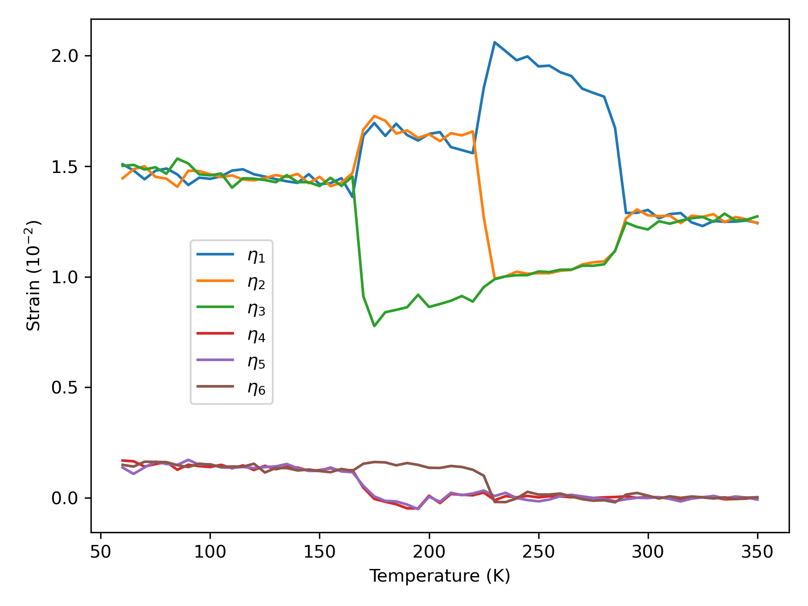
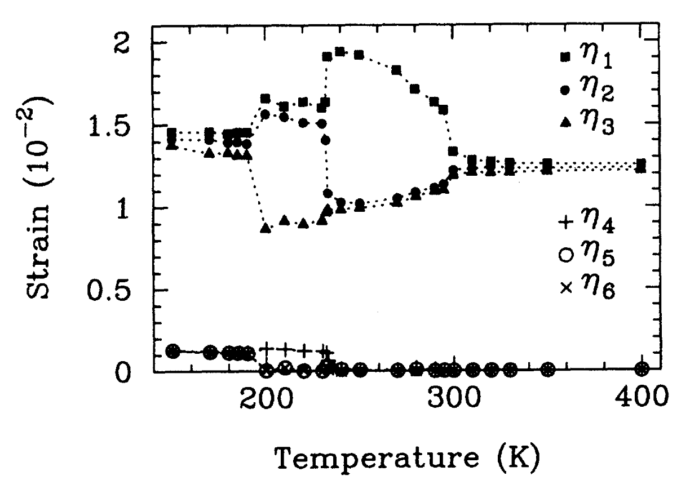

# FESim

BaTiO3 ferroelectric phase transition simulation based on effective Hamiltonian theory

[中文](https://github.com/yuchenxi2000/fesim/blob/main/README.md)

## Build

This project uses CMake.

```bash
# Clone with submodules
git clone --recurse-submodules https://github.com/yuchenxi2000/fesim.git
cd fesim

# macOS (Accelerate + Homebrew OpenMP/MPI, detected automatically)
cmake -B build -DCMAKE_BUILD_TYPE=Release
cmake --build build

# Linux HPC (Intel MKL + OpenMPI)
module load intel openmpi
cmake -B build -DCMAKE_BUILD_TYPE=Release
cmake --build build
```

CMake auto-detects the BLAS library (Intel MKL / Apple Accelerate / OpenBLAS). Binaries are placed in `build/fesim/main` (FESim) and `build/qmat/qmat` (QMat).

> If auto-detection fails, you can specify BLAS manually: `-DBLA_VENDOR=Intel10_64lp` or `-DBLAS_LIBRARIES=...`.

The following platforms have been tested:

| Platform | CPU | Compiler | BLAS | MPI |
|----------|-----|----------|------|-----|
| RHEL 8.5 | Xeon Gold 5320 (×2, 52C/104T) | GCC 8.5.0 / ICC 19.0.4 | MKL 2019.4 | OpenMPI 5.0.6 |
| macOS 26 | Apple M1 Pro (10C) | Apple Clang 21 | Accelerate | OpenMPI 5.0.7 |

## Usage

A full simulation has three steps: pre-compute the dipole matrix → run Monte Carlo → plot.

### 1. Compute the dipole interaction matrix (QMat)

Edit `qmat/dipole.ini`, then:

```bash
mpirun -np 4 build/qmat/qmat qmat/dipole.ini
```

The cache file is written to the current directory. QMat runs in parallel via MPI; adjust `-np` to your core count.

> **Important**: When generating input for FESim, set `ax = ay = az = 1.0` in the INI file. FESim applies the BaTiO3 lattice constant (7.456 Bohr) internally. The supercell dimensions `Nx, Ny, Nz` must match between QMat and FESim.

### 2. Run the Monte Carlo simulation (FESim)

Create `sim.ini`, then:

```bash
build/fesim/main ./sim.ini
```

If no config file is given, `./sim.ini` is used by default.

Key `sim.ini` parameters:

| Section | Parameter | Description |
|---------|-----------|-------------|
| `[sys]` | `Nx, Ny, Nz` | Supercell dimensions |
| `[init]` | `u, v` | `"random"` or path to a .bin file |
| `[init]` | `q` | Path to cache file from QMat |
| `[sim]` | `T` | Temperature (K) |
| `[sim]` | `steps` | Monte Carlo steps (≥ 500 recommended) |
| `[sim]` | `pressure` | Pressure in Pa (negative = tensile) |
| `[monitor]` | `eta_h, e` | Output paths and step intervals |
| `[out]` | `u, v, eta_h` | Final state output paths |

See `fesim/run-BTO.sh` for a full cooling-curve example (350 K down to 55 K). Update the `CALC_DIR`, `MAIN_BIN`, and `CACHE_Q` variables at the top of the script before running.

> A 10×10×10 supercell with 10,000 steps takes about one day on 64 cores. You can decrease STEPS to make it faster, but do not go below 500 — the results will not be meaningful.

### 3. Plot

```bash
python fesim/plot.py
```

Reads monitor output with numpy and plots strain vs. temperature with matplotlib.

> INI parsing is handled by [inih][2], included as a git submodule (`external/inih/`).

## Theory

The effective Hamiltonian is expanded into polynomials of local soft-mode amplitudes and strain tensors. Expansion coefficients are obtained from first-principles DFT calculations. Local modes and strain are used rather than bare atomic displacements for two reasons: (1) phonon modes have higher symmetry, leading to a compact expansion; (2) according to soft-mode theory, the soft phonon governs the ferroelectric transition, so higher-order phonons can be neglected.

With the Hamiltonian in hand, the phase transition is simulated using the Monte Carlo method from [Zhang et al., 1995][1].

## Results



Strain vs. temperature for a 10×10×10 supercell during cooling, showing the C → T → O → R phase transitions. Plotted by `fesim/plot.py`.



For comparison: the result from [Zhang et al., 1995][1]. Note that the order of strain components in Voigt notation appears inconsistent with the paper's definition. Section A defines the six components as e<sub>xx</sub>, e<sub>yy</sub>, e<sub>zz</sub>, e<sub>yz</sub>, e<sub>zx</sub>, e<sub>xy</sub>, but the figure appears to show e<sub>xx</sub>, e<sub>yy</sub>, e<sub>zz</sub>, e<sub>xy</sub>, e<sub>yz</sub>, e<sub>zx</sub>.

[1]: https://journals.aps.org/prb/abstract/10.1103/PhysRevB.52.6301 "Effective Hamiltonian theory"
[2]: https://github.com/benhoyt/inih "inih"
